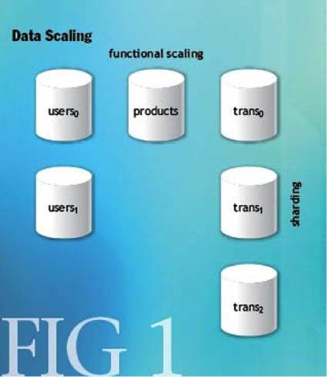
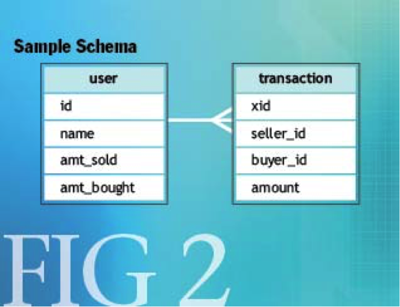
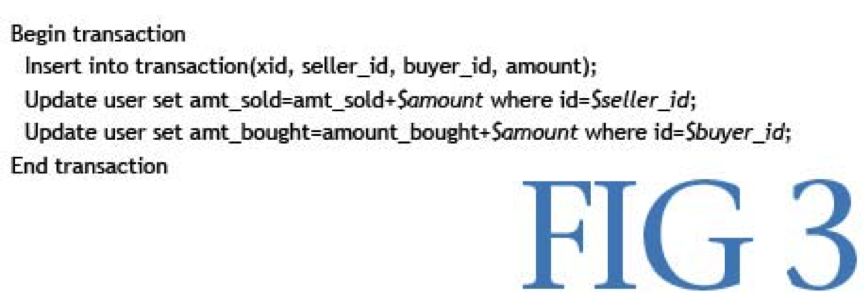
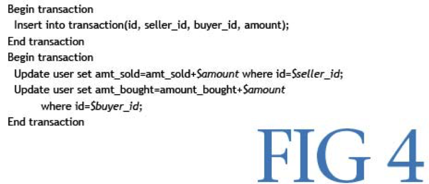
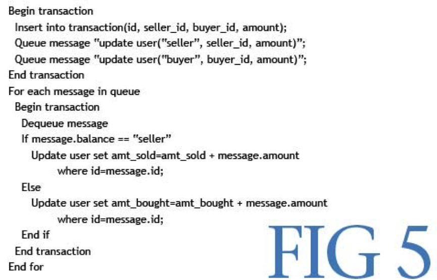
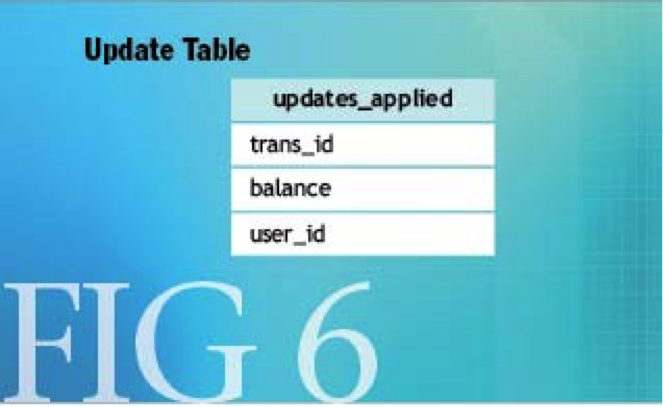
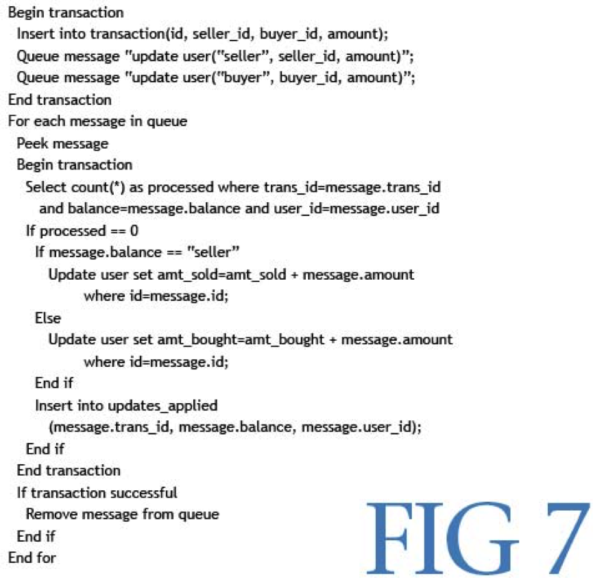
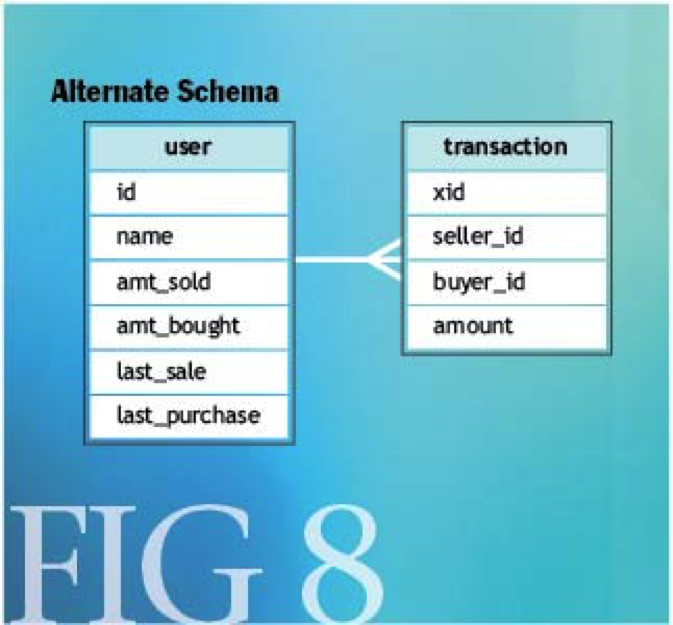
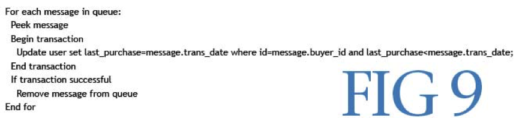

#BASE:一种ACID的替代方案
*在分区数据库中，为可用性牺牲一些一致性可以带来可扩展性的显著提高 -- Dan Pritchett, Ebay*   
*本文翻译至[base an acid alternative](https://queue.acm.org/detail.cfm?id=1394128),版权归原著作权所有。*  
  
在过去十年中，web应用已经变得越来越流行。无论你是最终用户还是应用程序（App）开发者（如，Service开发者），你都希望你的应用程序（App）将被广泛采用，随之带来业务增长。如果你的应用程序依赖持久层（persistence），那么数据存储将可能会成为你的瓶颈。  
有两种策略用户缩放任何应用程序（App），第一个，而且是最简单的，是垂直缩放：将应用程序移动到更大的计算机。垂直缩放对数据工作相当好，但有几个限制。 最明显的限制是超出了现有最大系统的容量。 垂直扩展也很昂贵，因为添加事务能力通常需要购买下一个更大的系统。 垂直扩展通常会造成供应商锁定，进一步增加成本。  
水平缩放提供了更多的灵活性，但也更加复杂。 可以沿着两个方向执行水平数据缩放。 对功能的扩展包括按功能对数据进行分组，并在数据库之间进行组播。 将功能区域中的数据分割到多个数据库或分片，1将第二个维度添加到水平缩放。 图1中的图示出了水平数据缩放策略。  

 
##功能分区
功能分区对于实现高度可扩展性很重要。 任何良好的数据库架构都会将模式分解为按功能分组的表。 用户，产品，交易和通信是功能区域的示例。 利用诸如外键的数据库概念是用于在这些功能区域之间维持一致性的常用方法。  
依赖数据库的限制，来确保跨功能组的一致性，那么需要创建数据库部署策略的耦合。为了约束被应用，这些表需要被放置到同一个单独的数据库服务器上，而防止数据库作为事物率的横向扩展增长。在大多数的情况下，最简单的扩展的机会是将功能组移动到其他的数据库服务器上。  
能够支持非常高容量的事务容量的模式将按照功能放置到不同的数据库服务器上。这就需要将数据依从数据库中移出到应用中。这也就引入了一些本文中后续介绍的一些挑战。 
 
####CAP定理
Eric Brewer 加州伯克利大学教授，做了一个这样一个假设：web服务不能同一时刻同时满足如下三个属性（简称`CAP`）：  
•	持久性 (Consistency) : 客户能够立刻感知到一系列操作后的数据。  
•	有效性 (Availability) : 每一个操作必须有一个确定性的结果。  
•	分区容忍 (Partition Tolerance )– 即使独立组件无效，操作也将完成。  
明确地说，无论在任何的数据库设计中， 一个web应用最多支持两个CAP属性。显而易见的说，任何的横向扩展策略都是基于数据分区的方式，即使如此，设计者仍然需要在持久性和有效性上作出选择。  
####ACID 方案
ACID数据库事务极大的简化了应用开发者的工作。ACID事务提供了如下的保障：
例如，如果我们假设每个数据库都是99.9%的可用性，那么事务类型的可用性是99.8%，或是额外宕机时间为每个月43分钟。 
####用ACID替代法则
如果ACID为分区数据库提供一致性选择，那么你如何实现高可用？一个答案是BASE(基本可用的，无链接的，最终一致性的)。  
BASE法则和ACID法则是完全对立的。其中ACID是悲观的，并约束在每一个操作结束是强制一致，BASE则是乐观的，并允许数据库处于一个通用一致性状态。 虽然这个听起来不是高一致性，但是实际上他是相对易于管理的，同时会导致不能通过ACID获取扩展性。  
BASE法则的可用性在于通过部分问题规避整个系统故障来实现，这里有很多例子：如果用户被分配到5个数据库服务器上，BASE设计允许在一定条件下，使得在固定服务器上的数据库故障只影响到20%的用户。这儿没有那么复杂，但是又同时提供了系统的可用性。  
所以，你现在会选择将你的数据分散到数据库集群中，如何在这里应用BASE法则？和ACID应用相比，BASE在一个事务中提供更深入的分析选项。那么我们如何看待？接下来会给你提供一些方向。  
####一致性模式
根据Brewer的猜想，如果BASE允许分区数据库的可用性，那么放松一致性的机会是必然的。但这是非常困难的，因为企业的利益相关者和开发商趋向于断言，一致性对应用的成功是最重要的。从最终用户来看暂时的不一致不能被屏蔽，所以工程负责人和产品负责人两者都必须挑选放松应用一致性要求的机会。   
图2是一个简单的例子，展示了BASE在一致性方面的考虑。user表保存用户的信息，包括出售和购买的总金额。这些是运行中的总数。transaction表保存有关的每一笔交易，包括买家和卖家以及交易的金额。虽然这些表相比真正的表过于粗略，但包含了展示一致性方面必要的元素了。  
 
一般情况下，跨功能组比在合在同一组内更容易放松一致性。示例模式有两个功能组：user和transaction。每次卖出一个物品，将会往transaction表添加一条记录和更新买方和卖方的计数。若SQL使用ACID式的事务，则对应的SQL将如在图3中所示。  

user表中的总购买和出售列可以认为是transaction表的一个缓存。这是本系统的效率。鉴于此，一致性的约束可以放宽。我们可以设置买卖双方方的预期，让他们知道他们的余额不会立即反映一个交易的结果。其实这是并不少见，事实上人们常常会遇到这种交易和他们的余额之间延迟的情况（例如，ATM取款和手机打电话）。  
如何修改SQL语句以支持放松一致性则取决于余额是如何定义的。如果它们是简单的估计，这意味着某些交易可以容忍丢失，那么修改就变得很简单了，如图4所示：  
 
现在，我们已经把更新操作从user表和transaction表分离了。表之间的一致性无法得到保证。事实上，若第一和第二个事务之间发生了故障，将导致user表中的永久不一致，但如果规定余额只用于估算的，这可能已经足够了。  
但如果估算是不能接受的呢？你将如何能够把更新操作从user表和transaction表解耦呢？这里介绍一个持久消息队列机制来解决这个问题。实现持久性消息有多种选择。但是，在实现队列中，最关键因素是确保在同一资源上的数据库上支持持久性[译者说明：即入队列的操作跟transaction在同一主机上，这样可以避免分布式事务的2PC]。这是必要的，能够保证跟事务提交队列无需涉及到2PC（两阶段提交）。现在的SQL操作看起来有点不同，如图5所示。  
 
这个例子需要一些自由的语法和非常简化的逻辑来说明这个概念。通过在同一事务中进行插入操作把永久消息入队列，能够捕获到更新正在运行的user表所需要的信息，该事务包含在单一的数据库实例中，因此不会影响系统的可用性。    

一个单独的消息处理组件会将分离消息并且将该消息中的信息应用到用户表。这个例子似乎解决了所有的问题，但有一个问题。消息的持久性在交易主机避免在排队中`2PC`。如果消息队列内部交易涉及的用户主机，我们还有`2PC`的情况。  
在消息处理组件的2PC的解决方案是什么也不做。通过将更新分离成一个单独的后端组件，您可以保留您的客户面向组件的可用性。较低的可用性的消息处理器可以是可接受的业务需求。  
假设，但是，在你的系统中，2pc简直是不可接受的。这个问题怎么解决？首先，你需要了解幂等性的概念。操作是幂等如果能够应用一次或多次相同的结果。幂等操作，他们允许部分失败是有用的，因为它们应用反复不会改变系统的最终状态。  
选择的例子是有问题的时候找幂等性。更新操作很少是幂等。增量平衡列的例子。应用此操作不止一次显然会导致一个不正确的平衡。即使更新操作简单的设置一个值，但不是幂等关于操作顺序。如果系统不能保证更新将被应用在他们收到的顺序，系统的最终状态将是不正确的。关于这点后面会有更多的介绍。  
在平衡更新的情况下，您需要一种方法来跟踪哪些更新已成功应用，哪还没有。一种技术是使用一个表，记录已应用的事务标识符。  
如图6所示的表跟踪事务标识，平衡已被更新，并应用了平衡的用户标识。现在我们的样品的伪代码如图7所示。  

 
这个例子的前提是能够提前预览到队列中的消息，并且成功对其进行处理操作。如果必要的话可以通过两个独立的处理来完成 ：一个位于消息队列，另一个在用户数据库。除非数据库操作成功提交，否则无法提交队列操作。现在程序允许部分失败，并提供担保而无需受限于两台电脑。  
如果只在乎排序的话，有一个确保幂等更新的小技巧。我们稍微调整一下样本示例，以凸显出挑战及解决办法（图8）。  

假设你仍然想追踪用户最后一天的买卖情况。你可以基于一个类似的方案，通过一条信息来更新数据，但这里存在一个问题。  

假设两次购买发生在一个很短的时间窗口内，我们的信息系统将无法保证有序的操作。现在有一种情况 ，就是按照某一处理后的消息话，你的last_purchase将会产生一个错误的值。不过，这种更新可以通过对SQL稍加处理来改正，参见图9。  

作为软件工程师，我们倾向于将系统作为封闭循环看待。考虑可预测输入和该输入产生的可预测输出项里，行为的可预测性。这对应软件系统研发是必要的。优点是在多数情况下，使用BASE不改变闭环系统的可预测性，但它确着眼于总体把控。  
一个简单的例子有助于说明此观点。因系统用户可以将资产转移给同一系统的其他用户。无论资产是什么 - 可能是货币或任何东西。假设已经分离了两个操作，即从一个用户取得资产，和将之转给在消息队列以供分离的另一用户。  
随即，该系统判断有不确定和有问题的地方。一段时间内的资产已离开一个用户，确并未转到另一用户。这个时间窗口的大小可以通过消息传递系统设计来判定。无论如何，在这个滞后从开始到结束状态过程中，没有用户拥有资产。  
如果我们从用户的角度来看这个，这种滞后可能是无关的，甚至感觉不到。当资产到达时，无论是接收用户还是发送用户都不知道。如果转出和接收用户之间的延迟只几秒钟，直接用户是感觉不到和可以容忍的。在这种情况下，即便我们在实施过程中使用软状态和最终一致性，此类滞后用户也是可以接受的。  

####事件驱动架构 
想知道何时状态变得一致，需要知道些什么呢？需要有实现这种状态的算法，即变为一致状态时传入的相关请求。简单方法是在状态变为一致的同时生成一个确认事件。  
继续与前面的例子，资产已转入时，需要通知用户什么呢？在处理过程中创建一个事件，以确保向转入用户提供获悉处理状态变化的途径。EDA（事件驱动架构）可以很大程度改进的可伸缩性和结构性去耦。EDA的应用本文不做讨论。  
##结论
衡量系统卓越处理效率需要一种新思路 – 资源策略管理。当负载需要通过大量的组件扩展时，传统处理模式是会发生问题的。反过来进行去耦的操作和运行处理，可在一致性成本上提高效率和可衡量性。BASE为以上去耦思路提供了一个模式。  

参考文献  
1.	http://highscalability.com/unorthodox-approach-database-design-coming-shard.  
2.	http://citeseer.ist.psu.edu/544596.html.  
DAN PRITCHETT 是一名eBay方面的技术人员，在过去4年中为该项目架构组成员。期间，他通过eBay商场，贝宝，和Skype联络战略、业务、产品、技术团队。在Sun微系统公司，休利特帕卡德，和Silicon Graphics，Pritchett等技术公司有超过20年的工作经验，在网络层协议和操作系统的系统设计和软件模式方面技术经验丰富，他还拥有密苏里堪萨斯大学，Rolla的计算机科学学士学位。  


